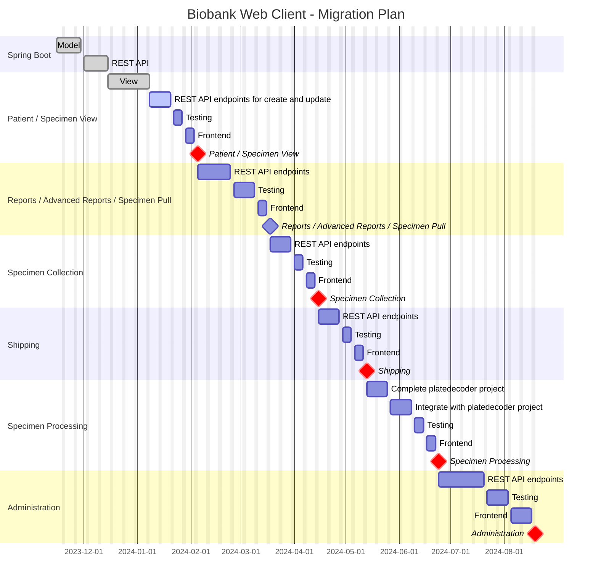

```mermaid
gantt
    title       Biobank Web Client - Migration Plan
    todayMarker off
    weekday monday
    dateFormat  YYYY-MM-DD
    excludes    weekends
    %% (`excludes` accepts specific dates in YYYY-MM-DD format, days of the week ("sunday") or "weekends", but not the word "weekdays".)

    section Spring Boot
    Model                      :done,    des1, 2023-11-15,10d
    REST API                   :done,    des1, 2023-12-01,10d

    section Patient / Specimen View
    View                                           :done, 2024-01-08
    REST API endpoints for create and update       :active, 10d
    Testing                                        :5d
    Frontend                                       :5d
    Patient / Specimen View                        :crit, milestone, m1

    section Reports / Advanced Reports / Specimen Pull
    REST API endpoints                  :15d
    Testing                             :10d
    Frontend                            :5d
    Reports / Advanced Reports / Specimen Pull : milestone, m2

    section Specimen Collection
    REST API endpoints                  :10d
    Testing                             :5d
    Frontend                            :5d
    Specimen Collection                 :crit, milestone, m3

    section Shipping
    REST API endpoints                  :10d
    Testing                             :5d
    Frontend                            :5d
    Shipping                            :crit, milestone, m4

    section Specimen Processing
    Complete platedecoder project       :10d
    Integrate with platedecoder project :10d
    Testing                             :5d
    Frontend                            :5d
    Specimen Processing                 :crit, milestone, m5

    section Administration
    REST API endpoints                  :20d
    Testing                             :10d
    Frontend                            :10d
    Administration                      :crit, milestone, m6
```
